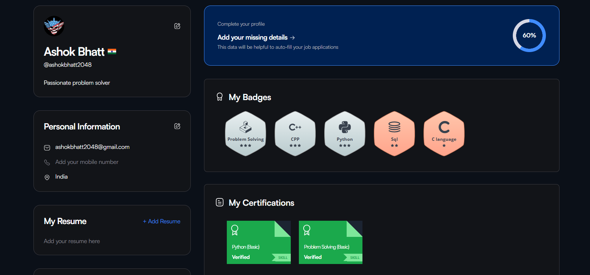

<h1 align="center">🚀 My HackerRank Journey</h1>

<p align="center">
  
  
  
</p>

<p align="center">
  
</p>

---

## 📌 About This Repository

Welcome to my **HackerRank Solutions** repository!  
Here you'll find solutions to problems I’ve solved on [HackerRank](https://www.hackerrank.com/).  
Most solutions are written in **C++** and **Python**, and focus on clean logic and readability.

---

## 🧠 Domains I'm Exploring

- Data Structures  
- Algorithms  
- Mathematics  
- C++  
- Python  
- SQL  
- Problem Solving (core skill)

---

## 🏆 My HackerRank Certifications

| Skill | Certification |
|-------|---------------|
| Problem Solving |  |
| Python |  |

> 📅 I'm trying to improve my problem solving skills!

---

## 📂 Folder Structure

```bash
📦HackerRank-Solutions/
├── Algorithms/
│   ├── SolveMeFirst.py
│   ├── Staircase.cpp
├── DataStructures/
│   ├── ArraysDS.cpp
│   ├── Linked_List.cpp
